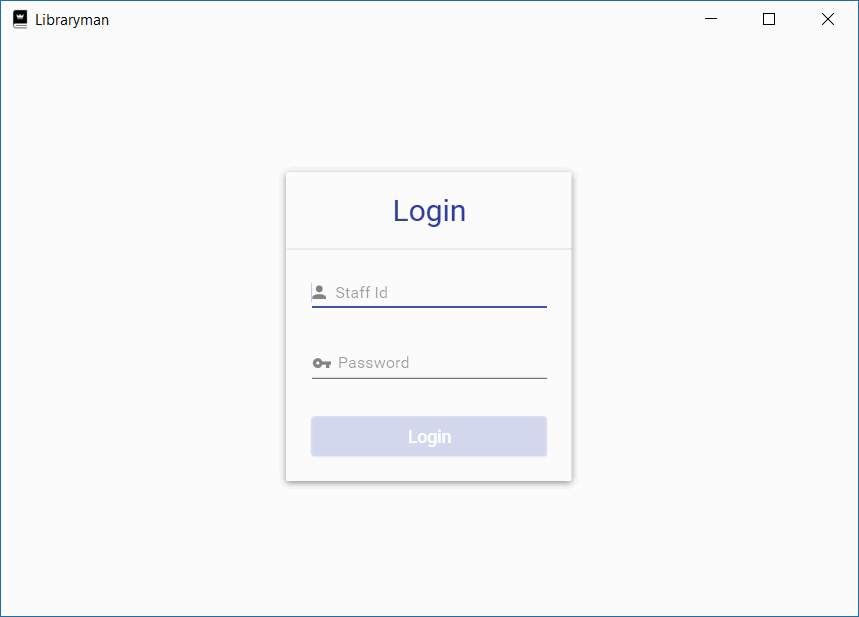
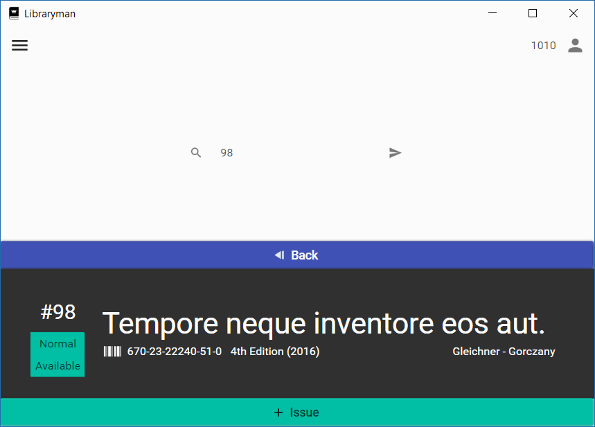
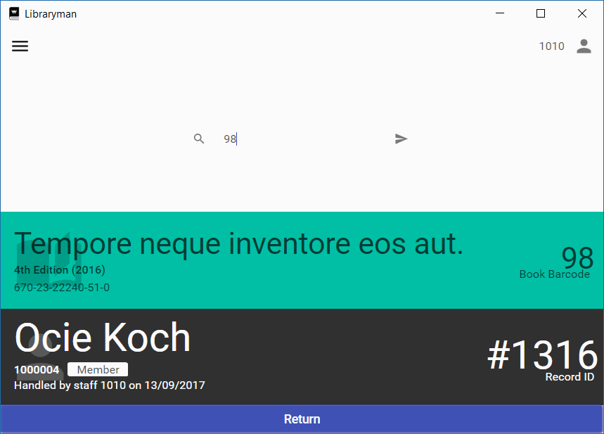
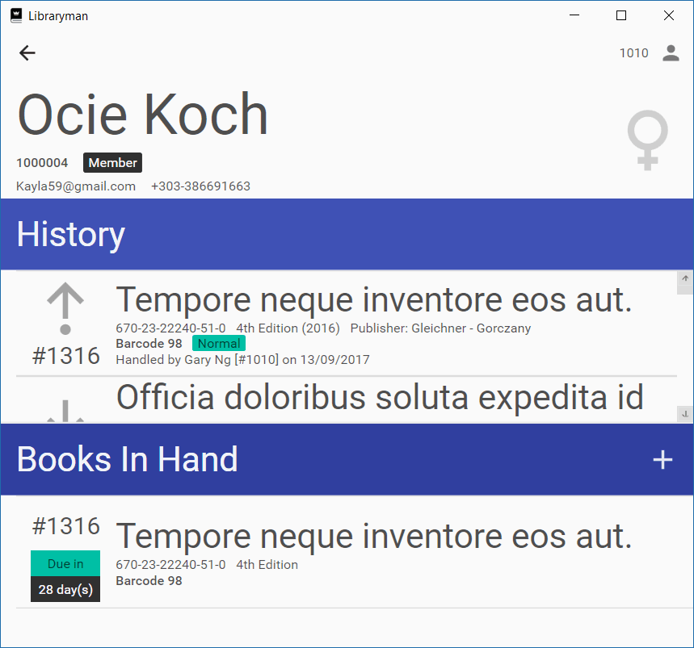

# Library Management System
A simple library management system implemented in C# WPF MVVM.

# Screenshots
## Login

## Dashboard

## Quick Issue
### Searching for user

### Issuing book to user
  
## Quick Return

## User
### Searching for user

### Viewing user details

# Others
This is a project made for my `TDB1131 Database Systems` subject.

# Credits
## Icons
  
King's Books by Alina Oleynik from the Noun Project